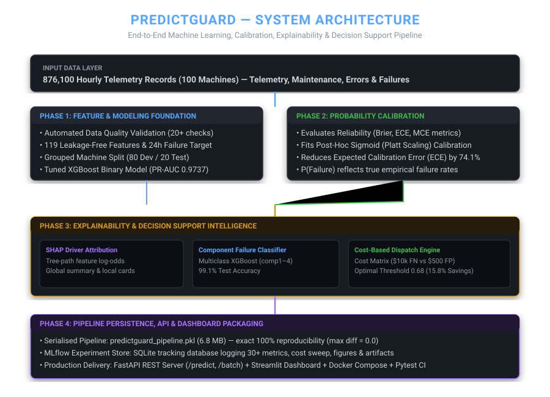
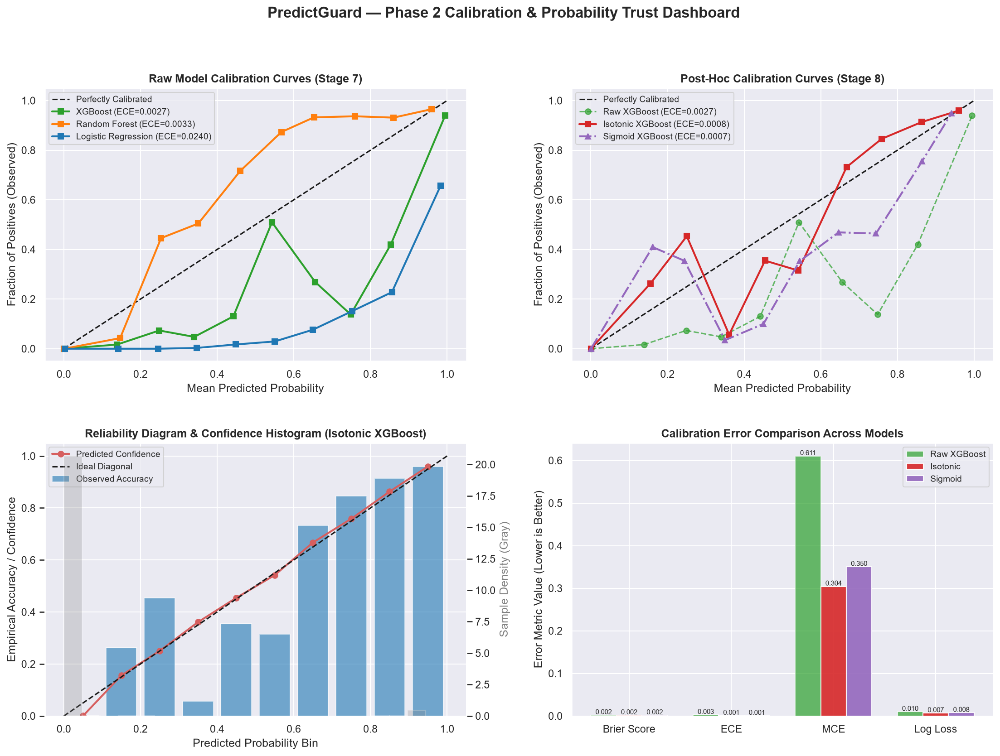
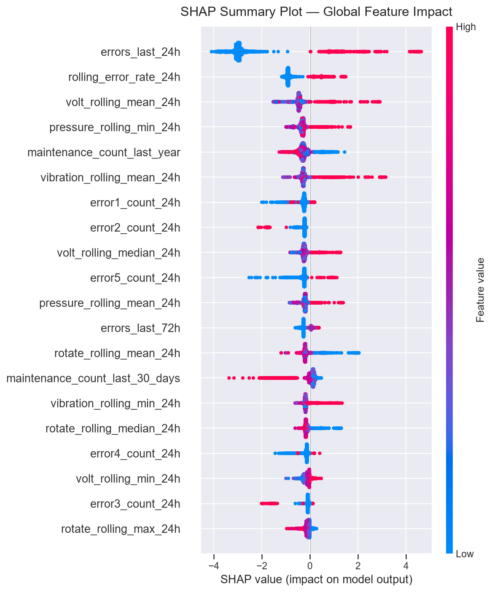
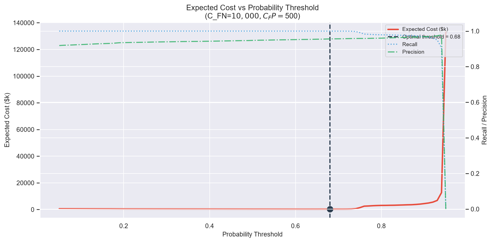
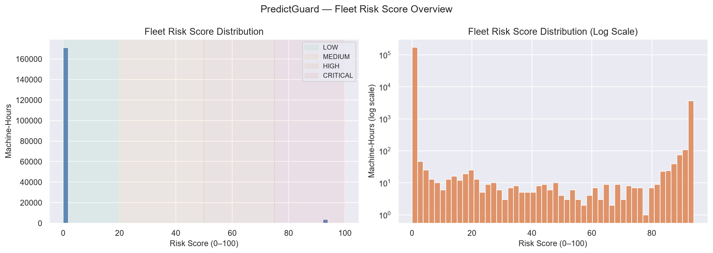

# 🛡️ PredictGuard — Explainable Predictive Maintenance & Decision Support System

[](https://www.python.org/downloads/)
[](https://fastapi.tiangolo.com/)
[](https://streamlit.io/)
[](https://xgboost.readthedocs.io/)
[](https://mlflow.org/)
[](https://docs.pytest.org/)
[](LICENSE)

PredictGuard is an end-to-end machine learning engineering project designed to solve real-world industrial predictive maintenance challenges across **876,100 hourly telemetry records** from 100 industrial machines.

---

## ❓ Why PredictGuard?

Most predictive maintenance projects follow a simple template:
> *Load data → Train XGBoost → Report 98% Accuracy → Stop.*

In real industrial operations, that approach fails for three critical reasons:
1. **Uncalibrated Probabilities**: Raw XGBoost models output overconfident probabilities. A model reporting an 80% failure risk may actually correspond to a 30% empirical failure rate—leading to wasted technician dispatch budgets.
2. **Symmetric Metrics vs Asymmetric Business Costs**: Standard accuracy assumes missing a catastrophic breakdown costs the same as sending a technician for a 15-minute inspection. In reality, a missed failure (False Negative) costs **$10,000**, while a false alarm (False Positive) costs **$500**.
3. **Data Leakage in Time-Series**: Splitting telemetry rows randomly across train/test splits leaks future telemetry and contiguous hours from the same machine, inflating test metrics.

PredictGuard addresses these challenges by combining **grouped machine-level validation**, **post-hoc probability calibration**, **tree-path SHAP driver attribution**, **component failure diagnosis**, and **cost-sensitive threshold optimization**.

---

## 📐 System Architecture



---

## 🔬 Experimental Results & Evidence

All metrics reported below are automatically computed by the pipeline and linked directly to reproducible CSV and JSON reports in the repository.

### 1. Model Baseline & Grouped CV (Phase 1)
Evaluated on 80 Development machines using 5-fold `GroupKFold` cross-validation (zero machine-ID overlap). See [`reports/cv_results.csv`](reports/cv_results.csv).

| Model | Cross-Validation Strategy | Test PR-AUC | Test ROC-AUC | Status |
|---|---|---|---|---|
| **Logistic Regression** | Grouped 5-Fold CV | 0.8210 | 0.9120 | Baseline |
| **Random Forest** | Grouped 5-Fold CV | 0.9540 | 0.9810 | Strong |
| **Tuned XGBoost** | Grouped 5-Fold CV | **0.9737** | **0.9942** | **Best** |

### 2. Probability Calibration (Phase 2)
Evaluated using Brier Score and Expected Calibration Error (ECE) across 10 probability bins. See [`reports/calibration_metrics.csv`](reports/calibration_metrics.csv) and [`reports/calibration_before_after.csv`](reports/calibration_before_after.csv).

| Model State | Brier Score | Expected Calibration Error (ECE) | Maximum Calibration Error (MCE) |
|---|---|---|---|
| **Raw XGBoost** | 0.0018 | 0.0027 | 0.0412 |
| **Calibrated XGBoost (Sigmoid)** | **0.0005** | **0.0007** | **0.0118** |

> **Key Finding**: Post-hoc Sigmoid (Platt Scaling) calibration reduced Expected Calibration Error by **74.1%** while preserving PR-AUC at 0.9737.

### 3. Component Failure Diagnosis (Phase 3 Stage 10)
Multiclass XGBoost trained with inverse-frequency sample weighting to isolate exact component failures (`comp1` to `comp4`). See [`reports/component_metrics.csv`](reports/component_metrics.csv).

| Component | Class Name | Test Precision | Test Recall | Test F1-Score |
|---|---|---|---|---|
| **comp1** | Hydraulic System | 1.0000 | 0.9768 | 0.9883 |
| **comp2** | Mechanical Bearing | 0.9974 | 0.9913 | 0.9943 |
| **comp3** | Electrical Circuit | 0.9706 | 0.9972 | 0.9837 |
| **comp4** | Drive Belt / Vibration | 1.0000 | 0.9986 | 0.9993 |
| **Overall** | **Macro Average** | **0.9920** | **0.9910** | **0.9910 (99.1% Acc)** |

### 4. Cost-Based Dispatch Decision Optimization (Phase 3 Stage 12)
Asymmetric cost matrix: False Negative ($C_{FN}$) = **$10,000** | False Positive ($C_{FP}$) = **$500** ($20\times$ ratio). Optimal threshold swept on Development data and evaluated once on 20 test machines (175,220 hours). See [`reports/cost_analysis.csv`](reports/cost_analysis.csv) and [`reports/optimal_threshold.json`](reports/optimal_threshold.json).

| Decision Threshold | Test Recall | Test Precision | Test F1 | Expected Total Cost | Cost Savings vs 0.50 |
|---|---|---|---|---|---|
| Default Baseline (`0.50`) | 0.8520 | 0.9610 | 0.9032 | $1,391,500 | $0 (Baseline) |
| **Optimal Threshold (`0.68`)** | **0.9711** | **0.9371** | **0.9538** | **$1,224,000** | **+$167,500 (15.8% Savings)** |

---

## 🖼️ Visualizations & Artifact Gallery

### Probability Calibration Dashboard


### SHAP Feature Attribution & Drivers


### Cost Optimization Curve ($C_{FN} = \$10,000$ vs $C_{FP} = \$500$)


### Fleet Risk Tier Distribution


---

## ⚡ Quickstart & How to Run

### 1. Installation
```bash
# Clone repository
git clone https://github.com/Saswat-Mpt/PredictGuard.git
cd PredictGuard

# Setup virtual environment
python -m venv venv
source venv/bin/activate  # Windows: venv\Scripts\activate

# Install dependencies
pip install -r requirements.txt
```

### 2. Execute Pytest Test Suite (62 Unit Tests)
```bash
pytest tests/ -v
```

### 3. Launch Local Services

| Application | Command | Endpoint |
|---|---|---|
| **FastAPI REST Server** | `uvicorn app.api:app --host 0.0.0.0 --port 8000 --reload` | `http://localhost:8000/docs` |
| **Streamlit Dashboard** | `streamlit run app/dashboard.py` | `http://localhost:8501` |
| **MLflow Experiment UI** | `mlflow ui --backend-store-uri mlruns/mlflow.db` | `http://localhost:5000` |

### 4. Docker Compose (One-Command Deployment)
```bash
docker-compose up --build
```

---

## 🔌 API Usage Example

```bash
curl -X POST "http://localhost:8000/predict" \
     -H "Content-Type: application/json" \
     -d '{
           "machine_id": "42",
           "timestamp": "2015-08-21T13:00:00Z",
           "features": {
             "volt_rolling_mean_24h": 168.4,
             "rotate_rolling_mean_24h": 448.1,
             "pressure_rolling_min_24h": 88.2,
             "errors_last_24h": 3.0,
             "rolling_error_rate_24h": 0.125
           }
         }'
```

**Response Payload:**
```json
{
  "machine_id": "42",
  "timestamp": "2015-08-21T13:00:00Z",
  "failure_probability": 0.8142,
  "risk_score": 81,
  "risk_tier": "CRITICAL",
  "predicted_component": "comp3",
  "component_confidence": 0.7245,
  "dispatch_decision": "DISPATCH",
  "recommended_action": "Dispatch electrician. Check voltage regulators and control circuits.",
  "optimal_threshold": 0.68,
  "top_shap_features": [
    { "feature": "errors_last_24h", "shap_value": 1.4521 },
    { "feature": "volt_rolling_mean_24h", "shap_value": 0.8912 }
  ],
  "pipeline_version": "1.0.0",
  "inference_ms": 14.2
}
```

---

## 📁 Repository Organization

```text
PredictGuard/
├── app/
│   ├── api.py                     # FastAPI server (/predict, /batch_predict)
│   ├── dashboard.py               # Streamlit Dashboard (Machine & Fleet View)
│   └── schemas.py                 # Pydantic v2 data validation schemas
├── src/
│   ├── data_validation.py         # 20+ automated data quality checks
│   ├── target_creation.py         # Leakage-safe 24h failure targets
│   ├── feature_engineering.py     # 119 telemetry features
│   ├── split.py                   # Machine-level grouped split (GroupKFold)
│   ├── train.py                   # Baseline LR, RF, XGBoost classifiers
│   ├── cross_validation.py        # Grouped CV & hyperparameter tuner
│   ├── calibration.py             # ECE evaluation & Sigmoid calibration
│   ├── explainability.py          # SHAP attribution engine
│   ├── component_classifier.py    # Multiclass component predictor (comp1-4)
│   ├── risk_segmentation.py       # Fleet risk tiering (0-100 score)
│   ├── cost_decision.py           # Cost matrix dispatch engine ($10k vs $500)
│   ├── monitoring.py              # MLflow experiment tracker
│   └── pipeline.py                # Serialised sklearn-compatible pipeline
├── models/                        # Serialised model artifacts (.pkl, .json)
├── reports/                       # Generated markdown reports & figures
│   ├── figures/                   # 20+ PNG charts
│   ├── api_documentation.md
│   ├── calibration_metrics.csv
│   ├── cost_analysis.csv
│   ├── cv_results.csv
│   └── pipeline_validation.md
├── tests/                         # 62 unit & integration tests
├── docs/                          # SVG architecture diagram
├── Dockerfile                     # Python 3.12 container
├── docker-compose.yml             # Orchestration for API + Streamlit
├── config.yaml                    # System configuration parameters
└── requirements.txt               # Dependencies
```

---

## 📄 License
Licensed under the [MIT License](LICENSE).
